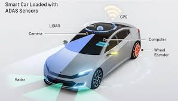

<h1>  Forward Collision Warning
 Development using GenAI </h1>

 

Accelerating ADAS Development with Generative AI
Problem: Developing and validating complex ADAS features like Forward Collision Warning (FCW) is a time-consuming process. Traditional methods involve lengthy development cycles, rigorous testing, and meticulous validation.

Solution: A Generative AI-Powered Development Framework

To streamline this process, we propose a framework leveraging Generative AI to accelerate ADAS development, validation, and deployment:

Key Components:

AI-Assisted Code Generation:
Automating code generation from high-level models and specifications.
Optimizing code for performance, efficiency, and safety.
Verifying generated code against functional and safety requirements.
Accelerated Simulation and Testing:
Creating realistic virtual environments for testing.
Rapidly testing ADAS features in simulated conditions.
Generating diverse and comprehensive test cases.
Enhanced Validation and Verification:
Rigorously proving the correctness of safety-critical software components.
Identifying potential vulnerabilities and improving robustness.
Continuously monitoring system performance and identifying improvement areas.
Efficient Embedded Porting:
Optimizing code for specific hardware platforms and embedded systems.
Automating code porting to different hardware and software configurations.
Implementation Considerations:

Data Quality and Quantity: Ensuring high-quality training data.
Model Validation and Calibration: Maintaining accuracy and reliability of AI models.
Human-in-the-Loop: Maintaining human oversight for ethical considerations and unforeseen challenges.
Safety and Security: Prioritizing safety and security throughout the development process.
Regulatory Compliance: Adhering to relevant industry standards and regulations.
Conclusion:

By leveraging Generative AI, we can revolutionize ADAS development, accelerating innovation, enhancing product quality, and ensuring the safe and reliable deployment of advanced automotive technologies.

